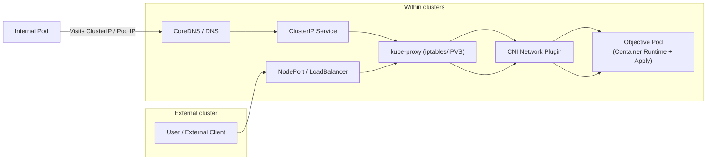

# Interview Question 21: Kubernetes Container Traffic Path to Pod

## Introduction
When users access a Pod, traffic may enter the Pod through different entry points (internal cluster / external).  
Understanding the traffic path helps troubleshoot network, Service, or Pod access anomalies.

## Traffic Path Overview

### 1. Internal Cluster Access to Pod
- A Pod within the cluster accesses another Pod  
- Process:
  1. Request initiated via **ClusterIP Service** or Pod IP  
  2. Traffic forwarded to target Pod via **kube-proxy** (iptables or IPVS)  
  3. Arrives at the target Pod container's network interface, received by **Container Runtime**  

### 2. External Cluster Access to Pod
- A user outside the cluster accesses a service  
- Process:
  1. External access to **NodePort** or **LoadBalancer** IP  
  2. Traffic reaches the target Node's kube-proxy  
  3. kube-proxy forwards to corresponding Pod (via ClusterIP / Endpoints)  
  4. Pod receives the request  

### 3. DNS Resolution
- Internal access resolves **Service name + Namespace** to ClusterIP  
- CoreDNS handles DNS queries  

### 4. Cross-Node Access
- When Pod is on different nodes, CNI plugin handles cross-node Pod network routing  
- kube-proxy maps Service traffic to correct Pod IP  

## Mermaid Traffic Diagram

## Key Points Summary

- Internal Access: Pod → Service → kube-proxy → Pod  
- External Access: External IP/NodePort/LoadBalancer → kube-proxy → Pod  
- DNS (CoreDNS) resolves Service names  
- Cross-node access depends on CNI plugin  
- Understanding traffic path helps quickly troubleshoot access anomalies, Service configuration, and network issues  

## Interview Answer Example

> "When users access Kubernetes Pods, internal Pods can initiate requests via Pod IP or ClusterIP Service. Traffic is forwarded to target Pod via kube-proxy and received by Container Runtime.  
> For external access, traffic arrives at nodes via NodePort or LoadBalancer IP, then forwarded to target Pod by kube-proxy. DNS (CoreDNS) resolves Service names, and cross-node access is handled by CNI network plugin. Understanding this traffic path helps quickly identify network or access anomalies."