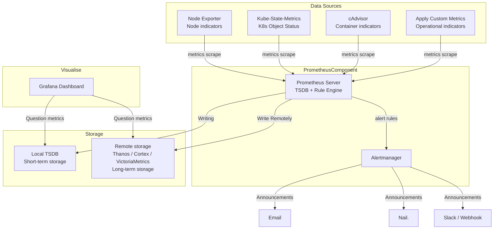

# Prometheus Monitoring System Full Component Architecture (Including Storage)

## Notes
Prometheus monitoring system includes **Data Sources → Prometheus Server → Storage → Visualization / Alerting**.  
Storage is divided into local TSDB (short-term storage) and remote storage (long-term storage, such as Thanos, Cortex, VictoriaMetrics).

### Key Components
- **Data Sources**:
  - NodeExporter: Node metrics (CPU, memory, disk, network)
  - cAdvisor: Container-level metrics
  - Kube-State-Metrics: Kubernetes object status
  - Custom Application Metrics: Business metrics
- **Prometheus Server**:
  - Scrape metrics
  - Store short-term data in local TSDB
  - Rule Engine triggers alerts
- **Alertmanager**:
  - Receives Prometheus alerts
  - Sends notifications according to rules (email, DingTalk, Slack/Webhook)
- **Storage**:
  - Local TSDB: Short-term storage, fast querying
  - Remote storage: Thanos / Cortex / VictoriaMetrics, used for long-term storage and horizontal scaling
- **Grafana**:
  - Query local TSDB or remote storage
  - Build dashboards and business views

## Mermaid Flow Architecture Diagram

## Key Points Summary
- Prometheus collects metrics from various data sources via scrape  
- Local TSDB stores short-term metrics, remote storage is used for long-term storage and scaling  
- Alertmanager handles alerts and sends notifications  
- Grafana queries TSDB / remote storage to display dashboards and business views  
- Understanding the system architecture helps with interview review and designing highly available monitoring solutions

## Interview Answer Example

> "Prometheus monitoring system includes data sources, Prometheus Server, storage, Alertmanager, and Grafana. Data sources provide node, container, and application metrics. Prometheus scrapes metrics and stores them in local TSDB. The Rule Engine triggers alerts to Alertmanager according to rules. Alertmanager sends emails, DingTalk, or Slack notifications. Grafana queries local TSDB or remote storage to display visualization dashboards. Remote storage is used for long-term storage and horizontal scaling. Understanding these components and data flow helps design highly available monitoring systems and troubleshoot issues."