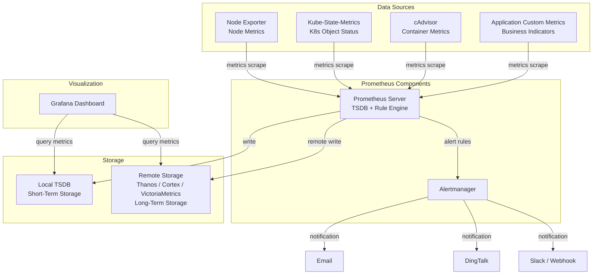

# Complete Architecture of the Prometheus Monitoring System (Including Storage)

## Explanation
The Prometheus monitoring system consists of **data sources → Prometheus Server → storage → visualization / alerts**.  
Storage is divided into local TSDB (short-term storage) and remote storage (long-term storage, such as Thanos, Cortex, VictoriaMetrics).

### Main Components
- **Data Sources**:
  - NodeExporter: Node metrics (CPU, memory, disk, network)
  - cAdvisor: Container-level metrics
  - Kube-State-Metrics: Kubernetes object status
  - Application-customized Metrics: Business-specific indicators
- **Prometheus Server**:
  - Collects metrics through scraping
  - Stores short-term data in local TSDB
  - Uses the Rule Engine to trigger alerts
- **Alertmanager**:
  - Receives alerts from Prometheus
  - Sends notifications according to rules (email, DingTalk, Slack/Webhook)
- **Storage**:
  - Local TSDB: Short-term storage for quick queries
  - Remote Storage: Thanos / Cortex / VictoriaMetrics for long-term storage and horizontal scaling
- **Grafana**:
  - Queries local TSDB or remote storage
  - Builds dashboards and business views

## Mermaid Flowchart

## Key Points Summary
- Prometheus collects metrics from various data sources through scraping.
- Local TSDB stores short-term data, while remote storage handles long-term archiving and scalability.
- Alertmanager processes alerts and sends notifications via email, DingTalk, or Slack.
- Grafana queries both local and remote storage to create visual dashboards.
- Understanding this architecture is crucial for interview preparation and designing highly available monitoring solutions.

## Interview Answer Example

> “The Prometheus monitoring system includes data sources, a Prometheus Server, storage systems, an Alertmanager, and Grafana. Data sources provide metrics from nodes, containers, and applications. The Prometheus Server collects these metrics and stores them in local TSDB for quick access. The Rule Engine uses these metrics to trigger alerts via the Alertmanager, which can notify users via email, DingTalk, or Slack. Grafana allows us to query stored data and create visual dashboards. Remote storage solutions like Thanos/Cortex/VictoriaMetrics ensure long-term data retention and scalability. A thorough understanding of these components and their interactions is essential for designing effective monitoring systems and troubleshooting issues.”